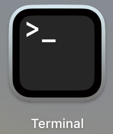

# Installation Instructions for MacOS

This document will walk you through the steps you need to perform to install and configure **Jupyter Lab**, the development software you will use for CS220.  You need to perform 5 steps:

1. Download and install Anaconda
2. Change the Python version
3. Enable the debugger
4. Associate notebook files with Jupyter lab
5. Test your configuration

## 1. Download and install Anaconda

[Anaconda](https://www.anaconda.com/) is a suite of software programs used for data science.  In a browser go to Anaconda's download page [https://www.anaconda.com/download/](https://www.anaconda.com/download/) to download the software.  You can either provide an email address and click the submit button or click the **Skip registration** to bypass providing your email.

On the download page, it should have detected your operating system and provided a link at the top of the page for the proper version.  You will need to know if your computer is an Apple Silicon or Intel chip.  If you click on the apple logo in the top left corner of your screen and select "About this Mac" a window will show you either the *Chip* type (Apple) or the *Processor* type (Intel) of your computer. 

Download and run the installer, following the instructions.  On the "Select a Destination:" page select "Install for all users of this computer" and finish running the installer.

## 2. Change Python version

You will be submitting your code to our grader, which is running a slightly older version of Python, version 3.10.12.  So you need to make sure you are running the same version on your computer.  Click on the Launchpad logo  and find and click on the other group  and then on the terminal  to open a program where you can type commands.  In the terminal window, type the command  `conda install python=3.10.12` and press enter.  Follow the instructions to have it proceed and install that version of Python.  When it is finished you can check that it has installed the proper version by typing `python --version` and then exit terminal.

## 3. Enable the debugger

One feature of Jupyter Lab that we will use this semester is the debugger.  It is disabled by default.  To enable it you will need to edit a text file.  Start by opening the finder
  and in the sidebar, click on Applications.  Anaconda Navigator will be one of the applications listed.

Now control-click on the Anaconda Navigator logo and select "show original" in the pop-up menu.  Browse inside the `anaconda3` folder to the `share\jupyter\kernels\python3\` folder and double click to open the kernel.json file in TextEdit.

The line that reads `"debugger": false` needs to be changed to be `"debugger": true` and then save the file.

## 4. Associate Notebook Files with Jupyter Lab

The files that we will be working with this semester are called *Jupyter Notebook* files.  These files have a file extension of `.ipynb`.  You can make it so that when you double click on a file that ends in `.ipynb` it will be opened by Jupyter Lab.

Download the [Test Configuration Notebook](https://git.doit.wisc.edu/cdis/cs/courses/cs220/cs220-lecture-material/-/raw/main/installation_instructions/test_configuration.ipynb?ref_type=heads&inline=false) and a [Jupyter Lab Associator Program](https://git.doit.wisc.edu/cdis/cs/courses/cs220/cs220-lecture-material/-/raw/main/installation_instructions/JupyterLabLaunchAssociator.zip?ref_type=heads&inline=false) which we will use to make the file assocation.  Open your Downloads folder with finder.   Click once on the `JupyterLabLaunchAssociator.zip` file and type Command-C to copy the file name.  Then control-click on the "Downloads" folder at the top of the window to see the parent directories and select the folder with your username.

In your username directory type option-command-V to move the zip file here and double-click on the zip file to extract the application.

In finder, go back to the Download's directory and control-click on the notebook file you downloaded.  In the pop-up menu select "open with -> other..." option

In the window browse to where you expanded the zip file to extract the application (i.e. click Download then go to the parent directory) and select the JupyterLabLauncher.app icon.  Before you click "Open" make sure you checkmark the "Always Open With" checkbox.

Go back to the Downloads folder and double-click to try and open the notebook file.  You will probably get one of two errors

On the first error click "Open" and then on the second error click the "Show in Finder" button. On the laucher logo control-click and select open.

Then, on this final error, click the "Open" button.

## 5. Test the configuration

Now, whenever you double-click on a Jupyter Notebook file, it should open that file in Jupyter Lab.  Follow the steps in the notebook to check your configuration and your software should be installed and configured correctly.